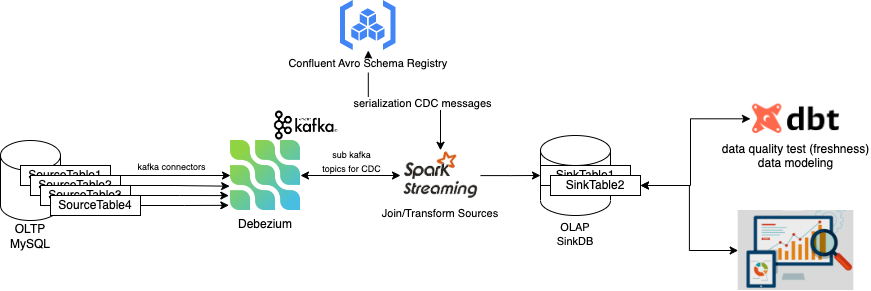

# CDC Ingestion Architecture
- This repo aims for implementing `Capturing Data Change` system by using [Debezium](https://debezium.io/) and Structured Spark Streaming.
- Written in Python and used Docker Compose for demonstration.



## Demo directories
```
.
├── docs/               # attached documentation
├── env/                # service environments
├── main.py             # main spark streaming service
├── pyspark.Dockerfile  # base image for running spark streaming service
├── schemas/            # predefined avro schemas
└── svc/                # service utility package
```

## Instructions
- to launch POC demo
```shell script
$ docker-compose build && docker-compose up -d
```

- to observe the logging of particular service
```shell script
$ docker-compose logs -f <service>
```

- tear down all services
```shell script
$ docker-compose down
```

## Notes
- to run kafka consumer on particular topic for debugging
```shell script
$ docker run -it --rm --name avro-consumer \
    --link zookeeper:zookeeper \
    --link kafka:kafka \
    --link mysql:mysql \
    --link schema-registry:schema-registry \
    --network home_credit_test_default \
    debezium/connect:1.9 \
    /kafka/bin/kafka-console-consumer.sh \
      --bootstrap-server kafka:9092 \
      --property print.key=true \
      --formatter io.confluent.kafka.formatter.AvroMessageFormatter \
      --property schema.registry.url=http://schema-registry:8081 \
      --topic dbserver1.inventory.customers
```

- this solution haven't synchronous the startup progress for services, as well as auto reconnect if some cases, thus some unexpected cases could be happened without the error, just need to restart services below `in order`:
```shell script
$ docker-compose restart connect            # http://localhost:8083/connectors/ is empty
$ docker-compose restart schema-registry    # http://localhost:8081/schemas/ is empty
$ docker-compose restart streamsvc          # to configure mysql connector
```
